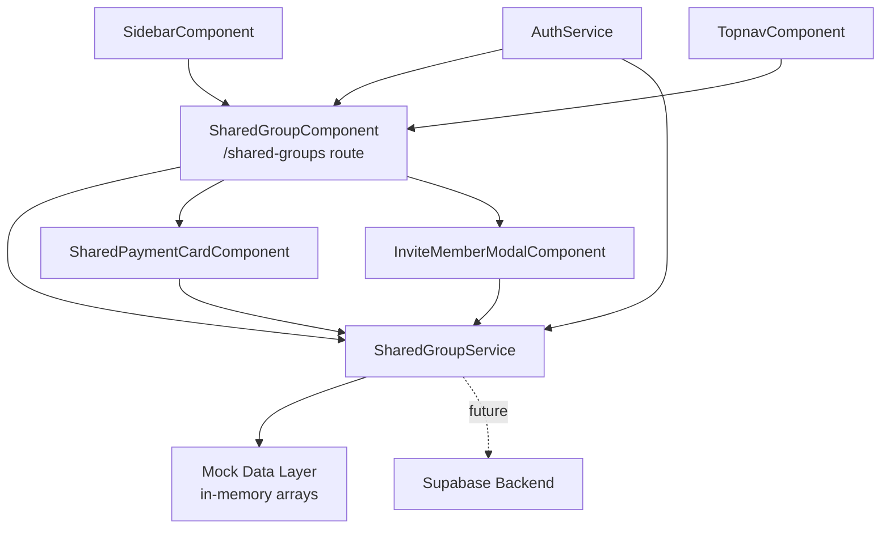

# Design Document: Shared Participation

## Overview

The Shared Participation feature allows two users to jointly occupy a single committee slot in the TrustCom Committee Management app. One user acts as the Group Leader and invites a second member. Both members contribute half the monthly committee amount independently, and the slot is only marked "Paid" once both contributions are confirmed.

This feature introduces four new artifacts into the Angular app:

- **`SharedGroupService`** — injectable service with TypeScript interfaces, mock data, and all business logic methods
- **`SharedGroupComponent`** — routed page component (`/shared-groups`) that lists all shared groups for the current user
- **`SharedPaymentCardComponent`** — presentational card component showing each member's payment status and upload controls
- **`InviteMemberModalComponent`** — modal dialog for the Group Leader to invite a second member

The feature is built with mock data first, following the same patterns as the existing `PaymentService` and `CommitteeService`, so that Supabase integration can be dropped in later without structural changes.

---

## Architecture

The feature follows the existing Angular 17+ standalone component architecture with signal-based state management.



**Data flow:**
1. `SharedGroupComponent` initialises on route load, calls `SharedGroupService.getMySharedGroups()` and stores results in a signal.
2. The component renders one `SharedPaymentCardComponent` per group.
3. When the Group Leader clicks "Invite Member", `SharedGroupComponent` opens `InviteMemberModalComponent` as an overlay.
4. All mutations (invite, cancel invite, upload proof, accept/reject proof) go through `SharedGroupService` methods, which update the in-memory mock store and return updated data.
5. The component re-reads the signal after each mutation to trigger re-render.

**State management:** All component state uses Angular `signal()` and `computed()` — consistent with `PaymentsComponent` and `MyCommitteesComponent`.

---

## Components and Interfaces

### SharedGroupComponent

**Selector:** `app-shared-group`  
**Route:** `/shared-groups` (protected by `authGuard` and `paymentSetupGuard`)  
**File:** `src/app/pages/shared-group/shared-group.ts`

Responsibilities:
- Load and display all shared groups for the current user
- Render `SharedPaymentCardComponent` for each group
- Open/close `InviteMemberModalComponent`
- Handle loading and error states

Signals:
```typescript
groups       = signal<SharedGroupCard[]>([]);
loading      = signal(true);
errorMsg     = signal('');
activeModal  = signal<string | null>(null); // group id of open invite modal
```

Template layout mirrors `payments.html`: `app-sidebar` + `app-topnav` + main content grid.

---

### SharedPaymentCardComponent

**Selector:** `app-shared-payment-card`  
**File:** `src/app/pages/shared-group/shared-payment-card.ts`

Inputs:
```typescript
@Input() card!: SharedGroupCard;
@Input() currentUserId!: string;
```

Outputs:
```typescript
@Output() inviteClicked    = new EventEmitter<SharedGroup>();
@Output() cancelInvite     = new EventEmitter<SharedGroup>();
@Output() uploadProof      = new EventEmitter<{ group: SharedGroup; memberId: string; file: File }>();
@Output() acceptProof      = new EventEmitter<{ group: SharedGroup; proofId: string }>();
@Output() rejectProof      = new EventEmitter<{ group: SharedGroup; proofId: string }>();
```

Responsibilities:
- Display group name, leader name, member name (or "Awaiting Member" placeholder)
- Display each member's `individual_contribution` in PKR
- Display `slot_payment_status` badge
- Display each member's `trust_score`
- Show upload controls per member (only to the relevant member)
- Show accept/reject controls to the admin/leader
- Show "Invite Member" button to the Group Leader when no member has joined
- Show "Cancel Invite" button to the Group Leader when status is "Pending Member"

---

### InviteMemberModalComponent

**Selector:** `app-invite-member-modal`  
**File:** `src/app/pages/shared-group/invite-member-modal.ts`

Inputs:
```typescript
@Input() group!: SharedGroup;
```

Outputs:
```typescript
@Output() submitted = new EventEmitter<{ groupId: string; inviteeEmail: string }>();
@Output() closed    = new EventEmitter<void>();
```

Contains a reactive form with a single email field. On submit, emits the `submitted` event with the group id and invitee email. The parent component calls `SharedGroupService.inviteMember()` and closes the modal.

---

### SharedGroupService

**File:** `src/app/core/shared-group.service.ts`  
**Provided in:** `root`

Public methods:

| Method | Description |
|---|---|
| `getMySharedGroups()` | Returns all shared groups where the current user is leader or member |
| `createSharedGroup(committeeId)` | Creates a new shared group for a committee slot |
| `inviteMember(groupId, inviteeEmail)` | Records an invitation, sets status to "Pending Member" |
| `acceptInvitation(groupId, userId)` | Assigns the user as Group Member, sets status to "Active" |
| `declineInvitation(groupId)` | Clears pending invitee, resets status to "Pending Member" |
| `cancelInvitation(groupId)` | Leader cancels pending invite, resets status to "Pending Member" |
| `uploadProof(groupId, memberId, file, monthYear)` | Validates and stores a payment proof for a member |
| `acceptProof(groupId, proofId)` | Sets proof status to "Accepted", updates member trust score |
| `rejectProof(groupId, proofId)` | Sets proof status to "Rejected" |
| `computeSlotPaymentStatus(group)` | Pure function: derives slot status from both members' proof statuses |
| `computeIndividualContribution(monthlyAmount)` | Pure function: returns `monthlyAmount / 2` |
| `computeWinnerShare(totalPayout)` | Pure function: returns `totalPayout / 2` |

---

## Data Models

```typescript
// ── Core domain interfaces ────────────────────────────────────────────────

export type SharedGroupStatus =
  | 'Pending Member'   // created, no member yet
  | 'Active'           // both members present
  | 'Completed';       // committee cycle ended

export type IndividualPaymentStatus =
  | 'Unpaid'
  | 'Submitted'
  | 'Accepted'
  | 'Rejected';

export type SlotPaymentStatus =
  | 'Unpaid'
  | 'Partially Paid'
  | 'Paid';

export interface SharedGroupMember {
  user_id:          string;
  full_name:        string;
  email:            string;
  trust_score:      number;          // 0–100
  payment_status:   IndividualPaymentStatus;
  proof?:           SharedPaymentProof;
}

export interface SharedPaymentProof {
  id:           string;
  uploader_id:  string;
  file_name:    string;
  file_type:    'image' | 'pdf';
  file_url:     string;
  month_year:   string;              // e.g. "2026-05"
  status:       IndividualPaymentStatus;
  created_at:   string;
}

export interface SharedGroup {
  id:                     string;
  committee_id:           string;
  committee_name:         string;
  monthly_amount:         number;    // full slot amount
  individual_contribution: number;   // monthly_amount / 2
  status:                 SharedGroupStatus;
  slot_payment_status:    SlotPaymentStatus;
  group_leader:           SharedGroupMember;
  group_member:           SharedGroupMember | null;  // null until accepted
  pending_invitee_email:  string | null;
  winner_payout?:         number;    // set when group wins
  created_at:             string;
}

// ── View model used by components ─────────────────────────────────────────

export interface SharedGroupCard {
  group:           SharedGroup;
  isLeader:        boolean;         // current user is group_leader
  isMember:        boolean;         // current user is group_member
  monthYear:       string;          // current payment cycle
  showUploadModal: boolean;
  uploading:       boolean;
  uploadError:     string;
}
```

**Slot payment status aggregation logic** (implemented in `computeSlotPaymentStatus`):

| Leader status | Member status | Slot status |
|---|---|---|
| Accepted | Accepted | Paid |
| Accepted | anything else | Partially Paid |
| anything else | Accepted | Partially Paid |
| anything else | anything else | Unpaid |

When `group_member` is `null` (no member yet), slot status is always `Unpaid`.

---

## Correctness Properties

*A property is a characteristic or behavior that should hold true across all valid executions of a system — essentially, a formal statement about what the system should do. Properties serve as the bridge between human-readable specifications and machine-verifiable correctness guarantees.*

**Property Reflection:** Before listing properties, redundant criteria were consolidated:
- Requirements 3.3, 3.4, 3.5, 5.1, 5.2, 5.3, 5.4 all describe the same slot status aggregation logic → merged into Property 3.
- Requirements 4.2 and 4.3 both describe the same upload operation → merged into Property 5.
- Requirements 4.6 and 4.7 both describe proof review outcomes → merged into Property 6.
- Requirements 7.1, 7.2, 7.5, 8.4 all describe card rendering completeness → merged into Property 8.
- Requirements 8.2 and 8.3 both describe trust score isolation → merged into Property 9.

---

### Property 1: Shared Group Creation Sets Leader

*For any* user who enables the "Join as Shared Group" option for a committee, the resulting `SharedGroup` object SHALL have `group_leader.user_id` equal to that user's id, and `group_member` SHALL be `null`.

**Validates: Requirements 1.2, 1.3**

---

### Property 2: One Shared Group Per Slot

*For any* committee slot already occupied by a `SharedGroup`, attempting to create a second `SharedGroup` for the same slot SHALL be rejected (return an error), leaving the original group unchanged.

**Validates: Requirements 1.4**

---

### Property 3: Slot Payment Status Aggregation

*For any* `SharedGroup` with two members, the computed `slot_payment_status` SHALL satisfy:
- If both members' `payment_status` are `"Accepted"` → `"Paid"`
- If exactly one member's `payment_status` is `"Accepted"` → `"Partially Paid"`
- If neither member's `payment_status` is `"Accepted"` → `"Unpaid"`

**Validates: Requirements 3.3, 3.4, 3.5, 5.1, 5.2, 5.3, 5.4**

---

### Property 4: Individual Contribution Calculation

*For any* committee `monthly_amount` (a positive number), `computeIndividualContribution(monthly_amount)` SHALL return exactly `monthly_amount / 2`.

**Validates: Requirements 3.1**

---

### Property 5: Proof Upload Associates Correctly

*For any* member uploading a valid payment proof (JPG, PNG, or PDF ≤ 5MB), the resulting `SharedPaymentProof` record SHALL have `uploader_id` equal to that member's `user_id`, `month_year` equal to the current payment cycle, and the member's `payment_status` SHALL become `"Submitted"`.

**Validates: Requirements 4.2, 4.3**

---

### Property 6: Proof Review Updates Only the Reviewed Member

*For any* `SharedGroup` and any proof belonging to member A, accepting or rejecting that proof SHALL update only member A's `payment_status` (to `"Accepted"` or `"Rejected"` respectively), leaving member B's `payment_status` unchanged.

**Validates: Requirements 4.6, 4.7**

---

### Property 7: File Validation Rejects Invalid Uploads

*For any* file whose MIME type is not in `{image/jpeg, image/png, application/pdf}`, or whose size exceeds 5MB, `uploadProof()` SHALL reject the upload and return a descriptive error message without creating a proof record.

**Validates: Requirements 4.4, 4.5**

---

### Property 8: Card Renders All Required Fields

*For any* `SharedGroup`, the rendered `SharedPaymentCardComponent` SHALL display: the group name, the Group Leader's name, the Group Member's name (or `"Awaiting Member"` when `group_member` is `null`), the `slot_payment_status`, each member's `individual_contribution` in PKR, and each member's `trust_score`.

**Validates: Requirements 7.1, 7.2, 7.5, 8.4**

---

### Property 9: Trust Score Updates Are Isolated

*For any* `SharedGroup`, accepting or missing a payment by member A SHALL update only member A's `trust_score`, leaving member B's `trust_score` unchanged.

**Validates: Requirements 8.2, 8.3**

---

### Property 10: Winner Share Calculation

*For any* total committee payout (a positive number), `computeWinnerShare(totalPayout)` SHALL return exactly `totalPayout / 2`.

**Validates: Requirements 6.1**

---

### Property 11: Invitation State Transitions

*For any* `SharedGroup` in `"Pending Member"` status, declining or canceling the invitation SHALL reset the group to `"Pending Member"` status with `pending_invitee_email` set to `null`, allowing a new invitation to be sent.

**Validates: Requirements 2.5, 9.3**

---

### Property 12: Management Actions Restricted to Group Leader

*For any* `SharedGroup` and any user whose `user_id` does not equal `group_leader.user_id`, the invite and cancel-invite actions SHALL NOT be available (the rendered card SHALL NOT show those controls for that user).

**Validates: Requirements 9.4**

---

## Error Handling

| Scenario | Handling |
|---|---|
| Service method called before auth is ready | Return `{ error: 'Not authenticated' }` |
| `createSharedGroup` called for an already-occupied slot | Return `{ error: 'Slot already occupied by a shared group' }` |
| `inviteMember` called by a non-leader | Return `{ error: 'Only the Group Leader can invite members' }` |
| `uploadProof` with invalid file type | Return `{ error: 'Only JPG, PNG, or PDF files are allowed.' }` |
| `uploadProof` with file > 5MB | Return `{ error: 'File must be under 5MB.' }` |
| `acceptProof` / `rejectProof` called on non-existent proof | Return `{ error: 'Proof not found' }` |
| Network/Supabase error (future) | Surface error message to component; component sets `errorMsg` signal |

All service methods return `{ data: T | null; error: string | null }` or `{ error: string | null }` — consistent with the existing `CommitteeService` and `PaymentService` patterns.

Components display errors using the same red banner pattern used in `payments.html`:
```html
@if (errorMsg()) {
  <div class="flex items-center gap-3 bg-[#ffdad6] border border-[#ba1a1a] text-[#ba1a1a] rounded-2xl px-5 py-4 mb-6 text-sm">
    <span class="material-symbols-outlined">error</span>{{ errorMsg() }}
  </div>
}
```

---

## Testing Strategy

### Unit Tests (Example-Based)

These cover specific scenarios, UI rendering checks, and integration points:

- `SharedGroupService.computeSlotPaymentStatus()` — concrete examples for each status combination
- `SharedGroupService.computeIndividualContribution()` — example: 10000 → 5000
- `SharedGroupService.computeWinnerShare()` — example: 120000 → 60000
- `SharedGroupComponent` renders loading skeleton, empty state, and card grid
- `SharedPaymentCardComponent` renders "Awaiting Member" placeholder when `group_member` is null
- `SharedPaymentCardComponent` shows invite button only to the Group Leader
- `InviteMemberModalComponent` validates email format before emitting `submitted`
- Upload modal shows correct error for invalid file type and oversized file

### Property-Based Tests

Property-based testing is appropriate here because the feature contains several pure calculation functions and data transformation rules that should hold universally across all valid inputs.

**Library:** [fast-check](https://github.com/dubzzz/fast-check) (TypeScript-native, works with Jest/Vitest)

**Configuration:** Minimum 100 iterations per property test.

**Tag format:** `// Feature: shared-participation, Property N: <property_text>`

Each correctness property from the design maps to exactly one property-based test:

| Property | Test description | Arbitraries |
|---|---|---|
| P1: Group creation sets leader | `fc.record({ userId: fc.uuid(), committeeId: fc.uuid() })` | Any user + committee |
| P2: One shared group per slot | `fc.record({ committeeId: fc.uuid() })` | Any committee id |
| P3: Slot status aggregation | `fc.record({ leaderStatus: fc.constantFrom(...), memberStatus: fc.constantFrom(...) })` | All status combinations |
| P4: Individual contribution | `fc.float({ min: 1, max: 10_000_000 })` | Any positive monthly amount |
| P5: Proof upload associates correctly | `fc.record({ userId: fc.uuid(), file: validFileArb })` | Any valid file + member |
| P6: Proof review isolates member | `fc.record({ groupId: fc.uuid(), memberId: fc.uuid() })` | Any group + member |
| P7: File validation rejects invalid | `fc.oneof(invalidMimeArb, oversizedFileArb)` | Any invalid file |
| P8: Card renders all fields | `fc.record({ group: sharedGroupArb })` | Any SharedGroup |
| P9: Trust score isolation | `fc.record({ group: sharedGroupArb })` | Any SharedGroup |
| P10: Winner share calculation | `fc.float({ min: 1, max: 100_000_000 })` | Any positive payout |
| P11: Invitation state transitions | `fc.record({ group: pendingGroupArb })` | Any pending group |
| P12: Management actions restricted | `fc.record({ group: sharedGroupArb, nonLeaderUserId: fc.uuid() })` | Any group + non-leader |

### Integration Tests

These verify the wiring between components and the service, and will also cover Supabase integration when the backend is connected:

- `SharedGroupComponent` calls `SharedGroupService.getMySharedGroups()` on init and renders results
- Invite flow: modal submit → service call → card status updates to "Pending Member"
- Upload flow: file select → service call → card proof preview updates
- Accept/reject flow: admin action → service call → member status badge updates
